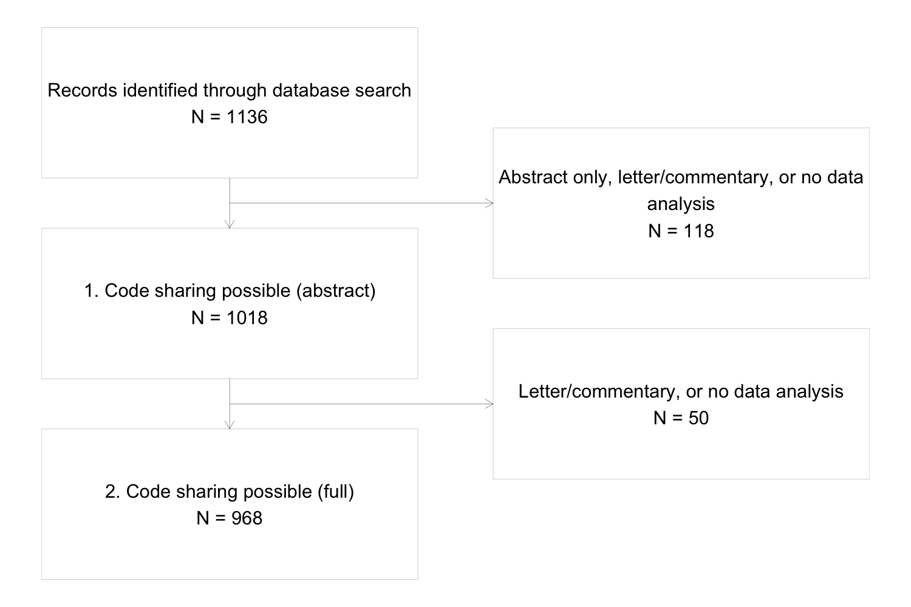

```{r setup, include=FALSE}
knitr::opts_chunk$set(echo = FALSE, warning = FALSE, message = FALSE)

# load required packages
library(tidyverse) 
library(janitor) 
library(readr)
library(lubridate) 
library(maps)
library(visR)
library(gt)
library(RColorBrewer)
library(tableone)
library(kableExtra)

# read in the clean data 
path <- getwd() 
data_path <- paste0(path, "/data")

results_filename <- paste0(path, "/data/clean_results.csv")
results <- read_csv(results_filename, show_col_types = F)

```

# 2. Literature review: summary and results  

## Study objectives

Our primary objective was to quantify the number and proportion of papers in a key pharmacoepidemiology journal (Pharmacoepidemiology and Drug Safety [PDS]) which published all or part of their programming code over the period 2017 - 2022. 

Secondary objectives: 

- To describe the prevalence of code sharing according to key paper characteristics (article type, funding source, and whether the research topic covered COVID-19) 
- Among papers who shared all or part of their code, to describe the method/platform used to share the code
- To describe the prevalence of other open research practices (study pre-registration, protocol sharing, data sharing, code-list sharing, use of checklists in the reporting, preprinting)

## Screening process

```{r, include = FALSE} 
source_filename <- paste0(path, "/data/all_pubs.csv")
source_pubs <- read_csv(source_filename, show_col_types = F)

anna_screen <- paste0(path, "/data/effort_Anna.csv")
effort_anna <- read_csv(anna_screen, show_col_types = F)

john_screen <- paste0(path, "/data/effort_John.csv")
effort_john <- read_csv(john_screen, show_col_types = F)

effort <- rbind(effort_anna, effort_john)

effort <- effort %>% 
  select(PMID, INCLUDE) %>% 
  mutate(full_screen = case_when(
    INCLUDE == "NO" ~ FALSE, 
    TRUE ~ TRUE 
  )) 

flowchart <- source_pubs %>% 
  left_join(effort, by = "PMID", keep = TRUE) %>% 
  select(-PMID.y) %>% 
  rename(PMID = PMID.x)

n1 <- nrow(source_pubs)
n2 <- nrow(flowchart[flowchart$INCLUDE != "NO",])
```

- We downloaded `r n1` articles published in PDS between 2017 and 2022 

  **Inclusion Criteria**
    1. Describes an analysis of real or simulated data 
    
  **Exclusion Criteria**
    1. Lacks a full-text version (abstract only)
    2. Letters to the Editor or Commentaries   

## A note on the inclusion criteria
- All papers which introduced new method included either a simulation study or a case study 
- A small number of papers described methods more generally: 
    - *Machine learning for improving high-dimensional proxy confounder adjustment in healthcare database studies: An overview of the current literature*
    - *Control yourself: ispe-endorsed guidance in the application of self-controlled study designs in pharmacoepidemiology* 
- These papers did not generate any code, although in theory they could have added illustrative code 
- We considered that papers for which no code was generated or could have been generated without changing the scope of the article were not eligible 
  
## Flowchart of screening progress

```{r flowchart, echo = FALSE, fig.width=10, fig.height=5, dev.args = list(bg = 'transparent')}
   
```

## Article characteristics 

```{r table one, include = FALSE}
part1 <- results %>% 
  mutate(any_language = ifelse(language_none == "Yes", "No", "Yes")) %>% 
  mutate(language_spss_excel = case_when(language_spss == "Yes" ~ "Yes", 
                                         language_excel == "Yes" ~ "Yes", 
                                         TRUE ~ "No")) %>% 
  select(year, article_type_pds_grouped, article_aim_clean, simulation, covid, reported_industry_affiliation, reported_industry_funds, 
         any_language, language_sas, language_r, language_stata, language_spss_excel) %>%
  mutate(year = as.factor(year)) %>% 
  rename(
    Year = year,
    "Publication type (PDS)" = article_type_pds_grouped,
    "Article type" = article_aim_clean,
    "Simulation study" = simulation, 
    "COVID-19 research" = covid,
    "Industry affiliation reported" = reported_industry_affiliation,
    "Industry funding reported" = reported_industry_funds, 
    "Reported programming language" = any_language, 
    "SAS" = language_sas, 
    "R" = language_r, 
    "Stata" = language_stata, 
    "SPSS/Excel" = language_spss_excel
  )

tb <-  CreateTableOne(data = part1)
k <- print(tb$CatTable)
```

```{r}
# format the table 

k %>% 
  kbl() %>% 
  kable_paper("hover", full_width=F, fixed_thead = F) %>% 
  column_spec(column = 1, width = "5.5in") %>% 
  row_spec(1, bold = T, background = "#d3d3d3") %>% 
  add_indent(c(3,4, 5, 6, 7, 8), level_of_indent = 1) %>% 
  add_indent(c(10,11,12), level_of_indent = 1) %>% 
  add_indent(c(14,15,16, 17, 18), level_of_indent = 1) %>% 
  add_indent(c(24,25,26,27), level_of_indent = 1) 
  
  
```

## Geographical spread 

```{r, echo=FALSE, warnings = FALSE, fig.width=10, fig.height=5, dev.args = list(bg = 'transparent')}
  
# extract country into it's own dataset for plotting separately 
country_data <- results %>% 
  select(country) %>% 
  # put each instance into a separate row and count them
  separate_rows(country, sep = ",") %>% 
  separate_rows(country, sep = "\\band\\b") %>% 
  # summary statistics 
  group_by(country) %>% 
  summarise(country_count = n()) %>% 
  arrange(country_count) %>% 
  # group the counts for more flexibility with the colour scale 
  mutate(country_count_fct = case_when(
    country_count > 100 ~ "100 - 200", 
    country_count < 100 & country_count >= 50 ~ "50 - 100", 
    country_count < 50 & country_count >= 25~ "25 - 50", 
    country_count < 25 & country_count >= 10 ~ "10 - 25", 
    country_count < 10 & country_count >= 2~ "2 - 10", 
    country_count < 2 ~ "1"), 
    country_count_fct = factor(country_count_fct, 
                               levels = c("1", "2 - 10", "10 - 25", "25 - 50", "50 - 100", "100 - 200"))) 
world <- map_data("world")

map_plot <- world %>%
  merge(country_data, by.x = "region", by.y = "country", all.x = T) %>%
  arrange(group, order) %>%
  ggplot(aes(x = long, y = lat, group = group, fill = country_count_fct)) + 
  geom_polygon(color = "white", size = 0.2) +
  theme_minimal() +
  theme(axis.text = element_blank(),
        axis.title = element_blank(),
        panel.grid = element_blank()) + 
  scale_fill_brewer(palette = 'PuBu', na.value = "gray90") + 
  labs(fill='Article Count') 

map_plot

```


```{r language, include=FALSE, fig.width=10, fig.height=5, dev.args = list(bg = 'transparent')}
language <- results %>% 
  select(language) %>% 
  mutate(language = case_when(
    str_detect(language, "entinel") ~ "Sentinel", 
    TRUE ~ language)) %>% 
  separate_rows(language, sep = ",") %>% 
  separate_rows(language, sep = "and") %>% 
  mutate(language = str_trim(language)) %>% 
  mutate(language = case_when(
    str_detect(language, "SPSS") ~ "SPSS", 
    str_detect(language, "GraphPad") ~ "GraphPad", 
    str_detect(language, "Joinpoint") ~ "Joinpoint", 
    str_detect(language, "JMP") ~ "JMP", 
    TRUE ~ language)) %>% 
  filter(!(str_detect(language, "specify"))) %>% 
  group_by(language) %>% 
  mutate(language = ifelse(n()>5, language, 'Other')) %>% 
  tally() %>% 
  ungroup() %>% 
  arrange((n))

# set the order of the factors to be the count 
language$language <- factor(language$language, levels=language$language)  

# plot as a bar chart 
ggplot(language, aes(x=language, y=n, fill=language)) + 
  geom_col() +
  scale_fill_brewer(palette = "PRGn", direction = 1) + 
  theme_minimal() + 
  labs(y = "Count", 
       x = "") + 
  theme(legend.position="none") + 
  coord_flip()
```


## Code sharing 

```{r, include = FALSE} 

n_extracted <- nrow(results)

n_shared <- nrow(results[results$shared_code == "Yes",])
n_accessible <- nrow(results[results$accessible_code == "Yes",])
n_available <- nrow(results[results$available_code,])

percent_shared <- round((n_shared/n_extracted)*100, 2) 
percent_accessible <- round((n_accessible/n_shared)*100, 2) 
percent_available <- round((n_accessible/n_extracted)*100, 2) 
  
```

- Overall, `r n_shared` papers mentioned or referenced code sharing in text or supplementary 
- Of those, `r n_accessible` (`r percent_accessible`%) had code which could be accessed without contacting the authors 

$~$

$~$

<center> __Of `r n_extracted` articles, `r n_accessible` (`r percent_available`%) shared code__ </center>

## Code sharing over time 

```{r, echo = FALSE, fig.width=10, fig.height=5, dev.args = list(bg = 'transparent')} 
sharing_over_time <- results %>% 
  group_by(year, shared_code) %>% 
  count() %>% 
  ungroup() %>% 
  mutate(shared_code = ifelse(shared_code == "Yes", n, 0) ) %>% 
  group_by(year) %>% 
  summarise(total_pub = sum(n), code_share=sum(shared_code), perc = round(100*code_share/total_pub, 2))

ggplot(data = sharing_over_time, aes(x=year, y=perc)) + 
  geom_line(color = "cornflowerblue") +
  geom_point(color = "cornflowerblue") +
  theme_minimal() + 
  labs(x ="Publication Year") +
  labs(y= "Percentage of code sharing (%)") + 
  ylim(0,15)
```

## Where was code shared? 

```{r code location, echo=FALSE, dev.args = list(bg = 'transparent')}
# create separate data set of code location as that could be more than one (for plotting)
code_location <- results %>% 
  filter(available_code) %>% 
  select(code_location) %>% 
  separate_rows(code_location, sep = ",") %>% 
  mutate(code_location = str_trim(code_location)) %>% 
  mutate(code_location = case_when(str_detect(code_location, "entinel") ~ "Sentinel", 
                                   str_detect(code_location, "Personal") ~ "Personal Webpage", 
                                   str_detect(code_location, "Pseudocode") ~ "Supplementary materials (doc or pdf)",
                                   str_detect(code_location,"equest") ~ 	"Available on request", 
                                   str_detect(code_location,"dataverse") ~ "Available on request",  
                                   TRUE ~ code_location)) %>% 
  mutate(code_location = case_when(str_detect(code_location, "doc") ~ "Supplementary doc or pdf", 
                                   str_detect(code_location, "program") ~ "Supplementary programming files",
                                   TRUE ~ code_location)) %>% 
  group_by(code_location) %>% 
  tally() %>% 
  arrange((n))

# set the order of the factors to be the count 
code_location$code_location <- factor(code_location$code_location, levels=code_location$code_location)  

# plot as a bar chart 
ggplot(code_location, aes(x=code_location, y=n, fill=code_location)) + 
  geom_col() +
  scale_fill_brewer(palette = "PuBuGn", direction = 1) + 
  theme_minimal() + 
  labs(y = "Count", 
       x = "") + 
  theme(legend.position="none") + 
  coord_flip()
```

## Features of code sharing 

```{r T2, include=FALSE}

# T2 code sharing characteristics 
code_sharing_chars <- results %>% 
  select(available_code, pipeline_coverage, instructions, synthetic, license, language_r, language_sas, language_stata) %>% 
  filter(available_code) %>%
  # Pipeline coverage
  mutate(pipeline_stat = case_when(
      str_detect(pipeline_coverage, 'analysis') ~ "Yes", 
      TRUE ~ "No"),
    pipeline_meth = case_when(
      str_detect(pipeline_coverage, 'package') ~ "Yes", 
      TRUE ~ "No"),
    pipeline_ill = case_when(
      str_detect(pipeline_coverage, 'Illustrative') ~ "Yes", 
      TRUE ~ "No"),
    pipeline_creat = case_when(
      str_detect(pipeline_coverage, 'Creation') ~ "Yes", 
      TRUE ~ "No"),
  ) %>% 
  mutate(synthetic = ifelse(synthetic == "Yes", "Yes", "No or not possible to assess")) %>% 
  select(-pipeline_coverage) %>% 
  rename("Shared code" = available_code,
    "Pipeline coverage: statistical analysis" = pipeline_stat,
    "Pipeline coverage: methods" = pipeline_meth, 
    "Pipeline coverage: illustrative" = pipeline_ill, 
    "Pipeline coverage: data management" = pipeline_creat, 
    "Was synthetic data provided? " = synthetic, 
    "Were there instructions for how to run the code?" = instructions, 
    "Was there a license?" = license, 
    "SAS" = language_sas, 
    "R" = language_r, 
    "Stata" = language_stata)

tb <-  CreateTableOne(data = code_sharing_chars)
k <- print(tb$CatTable)
```


```{r}
# format the table 

k %>% 
  kbl() %>% 
  kable_paper("hover", full_width=F, fixed_thead = F) %>% 
  column_spec(column = 1, width = "5.5in") %>% 
  row_spec(1, bold = T, background = "#d3d3d3") %>% 
  add_indent(c(4, 5, 6, 7), level_of_indent = 1) 
  
```

## Where a license was given, what was the license? 

```{r license, echo = FALSE}
license <- results %>% 
  filter(license == "Yes") %>% 
  select(license_type) %>%
  mutate(license_type = case_when(str_detect(license_type, "GP") ~ "GPL v3.0 (https://www.gnu.org/licenses/gpl-3.0.txt)", 
                                  TRUE ~ license_type)) %>% 
  distinct(license_type)

license %>% 
  kbl() %>% 
  kable_paper("hover", full_width=F, fixed_thead = F) 
```


## Code sharing by other characteristics 

```{r table three, include = FALSE}

part1 <- results %>% 
    select(article_aim_clean, simulation, covid, reported_industry_funds, available_code, language_r, language_stata, language_sas) %>%
    mutate("Code Shared" = ifelse(available_code ==TRUE, "Yes", "No")) %>% 
    rename(
      "Article type" = article_aim_clean,
      "COVID-19 research" = covid,
      "Industry funding reported" = reported_industry_funds,
      "Simulation study" = simulation, 
      "R" = language_r, 
      "Stata" = language_stata, 
      "SAS" = language_sas
    ) 
  
  myVars <- c("Article type", "Simulation study", "COVID-19 research", "Industry funding reported", "R", "Stata", "SAS")
  
  tb <- CreateTableOne(data = part1, strata = "Code Shared", vars = myVars, test = FALSE)
  
  k <- as.data.frame(print(tb$CatTable)) %>% 
    mutate(No = as.numeric(substr(No, 1,3))) %>% 
    mutate(Yes = as.numeric(substr(Yes, 1,3))) %>% 
    mutate(Per1 = round(100*No/(No + Yes), 0)) %>%
    mutate(Per2 = round(100*Yes/(No + Yes), 0)) %>% 
    mutate(No = paste0(as.character(No), " (", as.character(Per1), "%)")) %>%
    mutate(Yes = paste0(as.character(Yes), " (", as.character(Per2), "%)")) %>%
    select(No, Yes) %>% 
    mutate(No = ifelse(str_detect(No, "NA"), "", No)) %>%
    mutate(Yes = ifelse(str_detect(Yes, "NA"), "", Yes))

```


```{r}
# format the table 

k %>% 
  kbl() %>% 
  kable_paper("hover", full_width=F, fixed_thead = F) %>% 
  column_spec(column = 1, width = "5.5in") %>% 
  row_spec(0, bold = T) %>% 
  add_indent(c(3, 4, 5, 6, 7), level_of_indent = 1)
  
```

## Other open research practices 

```{r table four, include = FALSE}
other_orps <- results %>% 
  select(preregister,data_sharing, codelist_sharing, guideline) %>%
  mutate(data_sharing = case_when(
      str_detect(data_sharing, 'access') ~ "Data access procedures described or available on request", 
      str_detect(data_sharing, 'Yes') ~ "Yes", 
      TRUE ~ "No")) %>% 
    mutate(protocol_sharing = case_when(
      str_detect(preregister, 'Yes') ~ "Yes", 
      TRUE ~ preregister)) %>% 
  rename("Reporting guideline stated"= guideline,
    "Reported pre-registration" = protocol_sharing,
    "Data sharing" = data_sharing,
    "Codelist sharing" =  codelist_sharing
  ) %>% 
  select(-preregister)

tb <-  CreateTableOne(data = other_orps)
k <- print(tb$CatTable)
```

```{r}
# format the table 
k %>% 
  kbl() %>% 
  kable_paper("hover", full_width=F, fixed_thead = F) %>% 
  row_spec(1, bold = T, background = "#d3d3d3") %>% 
  add_indent(c(3,4,5,7,8,9,10), level_of_indent = 1) 
```

## Which reporting guidelines were featured? 

```{r guideline, echo = FALSE}

guidelines <- results %>% 
  filter(guideline == "Yes") %>% 
  select(guideline_type) %>% 
  separate_rows(guideline_type, sep = ",") %>% 
  mutate(guideline_type = str_trim(guideline_type)) %>% 
  # cochrane handbook not a guideline, recode 
  mutate(is_guideline = case_when(str_detect(guideline_type, '\\bCochrane\\b') ~ "No", 
                                    TRUE ~ "Yes")) %>% 
  filter(is_guideline == "Yes") %>% 
  group_by(guideline_type) %>% 
  tally() %>% 
  arrange((n))

# set the order of the factors to be the count 
guidelines$guideline_type <- factor(guidelines$guideline_type, levels=guidelines$guideline_type)  

# plot as a bar chart 
ggplot(guidelines, aes(x=guideline_type, y=n, fill=guideline_type)) + 
  geom_col() +
  scale_fill_brewer(palette = "PRGn", direction = 1) + 
  theme_minimal() + 
  labs(y = "Count", 
       x = "") + 
  theme(legend.position="none") + 
  coord_flip()

```

# 3. Literature review: discussion and feedback

## Tentative Conclusions 
- Reporting on open research practices was not standardised 
    - Some papers had an "Open Research" header, but the vast majority did not 
    
```{r openresearch, echo = FALSE, out.width = "400px"}
   
```

## Tentative Conclusions 
- Reporting on open research practices was not standardised 
    - Some papers had an "Open Research" header, but the vast majority did not 
- Standardised reporting, for example as part of the submission portal process, could:
    - make information on open research practices more accessible and easier to find, 
    - enable automated extraction tools to monitor progress
    - potentially increase the quality of open research reporting 


